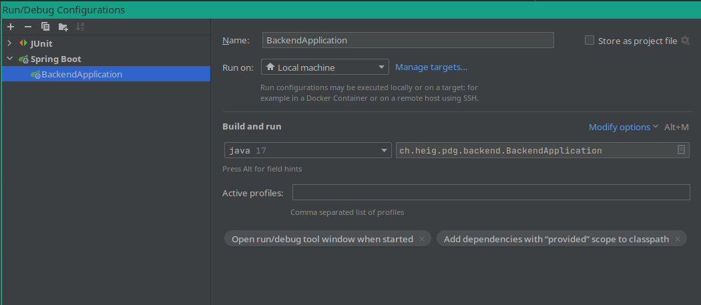
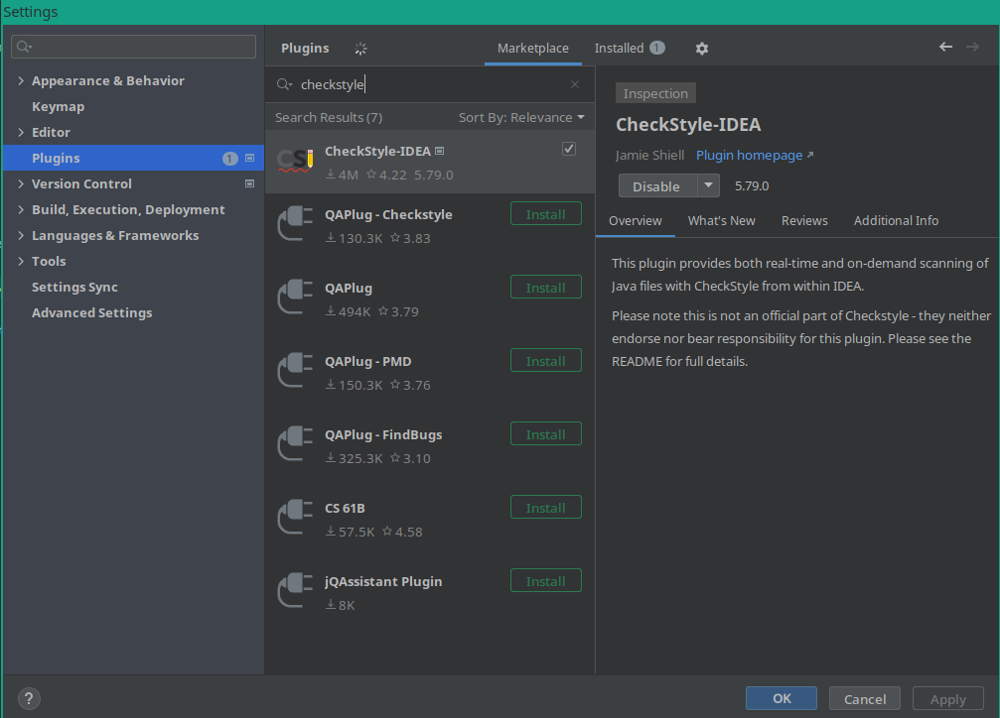
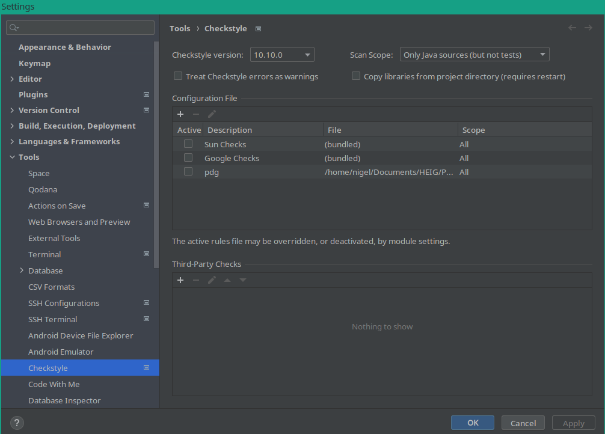

# Store-Me Backend

> This file describe the backend application of the project.  
> To know about more this project, go [here](../../README.md).

## Setup
In order for the backend to run the database must be accessible

for this go into the project root directory (../../) and run `docker-compose up`

## IDE
Intellij is the choose IDE for the backend.

Simply open the project and the configuration should be added by itself

In case this does not happen just add a run configuration like shown below

!

Then press the play or debug depending on your needs

## Test and style
The project has integration and unit test

The simplest way to run then is the use the command line.

Just type `mvn clean verify` and all test will run

If you want to run only one test class open it and click on the play button beside the class name or if you want to run only one test the test method click the play button on the choosen method

For enforcing CGL we use [CheckStyle](https://checkstyle.org/)

To add then to intellij install the CheckStyle plugin

!

Then add a configuration by going to settings, searching for checkstyle and clicking on the plus button. Then select `checkstyle.xml`
Now you can select whis configuration in the CheckStyle pannel.

!

