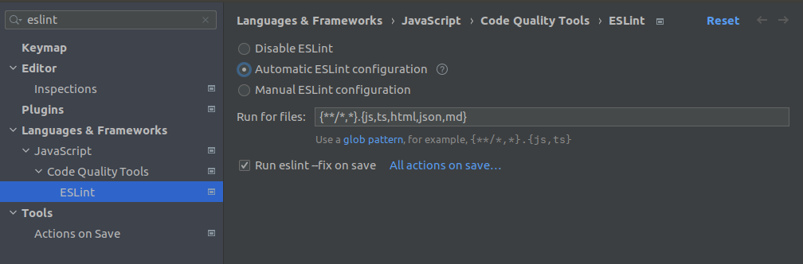
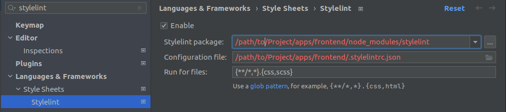
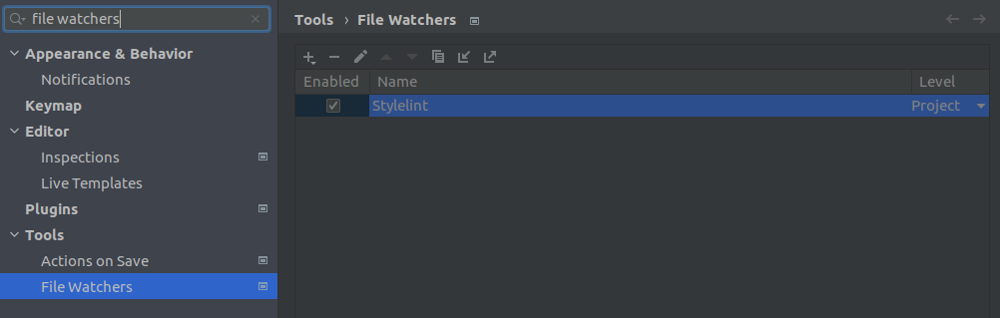
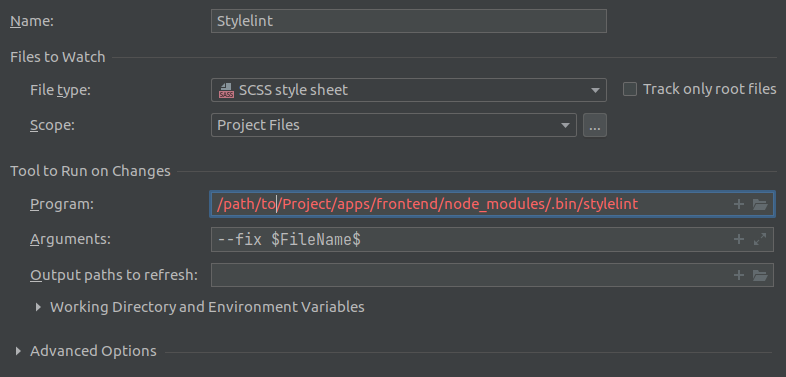

# Frontend Styleguide

<!-- TOC -->
* [Frontend Styleguide](#frontend-styleguide)
  * [IDE integrations](#ide-integrations)
    * [Eslint/Prettier](#eslintprettier)
      * [IDEs integration](#ides-integration)
        * [JetBrains (Webstorm)](#jetbrains-webstorm)
        * [Visual studio code](#visual-studio-code)
    * [Stylelint](#stylelint)
      * [IDEs integration](#ides-integration-1)
        * [JetBrains (Webstorm)](#jetbrains-webstorm-1)
    * [Note on integrations](#note-on-integrations)
  * [HTML](#html)
    * [classes](#classes)
<!-- TOC -->

> This file describe the styleguide applied to this application.  
> To read global styleguide, go [here](../../docs/styleguide.md).

## IDE integrations

### Eslint/Prettier

_Eslint_ with _Prettier_ is configured to format all code (and more) of this application.

The formatter can be run with the following command:

```bash
npm run lint:code:fix
```

> The command is run from `apps/frontend/` directory of this project.
>
> To understand others npm commands.  
> See [here](../README.md#commands).

#### IDEs integration

Eslint can be easily run _on save_ on IDEs.

##### JetBrains (Webstorm)

These IDEs can automatically detect Eslint.
In case they do not, it is possible to set it manually:



> It is not necessary to enable _Prettier_ individually, _Eslint_ already integrates it.

##### Visual studio code

[TODO]

### Stylelint

Like _Eslint_, _Stylelint_ is also used for this application

The formatter can be run with the following command:

```bash
npm run lint:style:fix
```

> The command is run from `apps/frontend/` directory of this project.
>
> To understand others npm commands.  
> See [here](../README.md#commands).

#### IDEs integration

Stylelint can be integrated in IDEs.

##### JetBrains (Webstorm)

To integrate within _Webstorm_:



However, this does not enable modification _on save_.
It needs to add a file watcher:



With the given options:



### Note on integrations

The manual manipulations of the previous sections should not be necessary
if the IDE is opened directly in the application folder.

## Global

### Text

Even if the application is only english-translated,
all texts must use the translation system (expect the landing page for now).

It allows a "cleaner" code and is more easily translatable to another language.

## HTML

Anything that goes to HTML files.

### classes

Use as much as possible the base classes defined in `styles.scss`.

The classes should be ordered.

### Typescript

Anything that goes to Typescript files.

#### Views

The _views_ components are the entrypoints of the site.
They do not have a selector.
A view can respond to many _paths_

A view should have in its file something to define its only or many _route paths_ and _paths_.

The _route paths_ are only used to configure the router
and the paths for being able to load the view from the page.  
The distinct should be clear with, for instance, the prefix `ROUTE_PATH` for the _route paths_.

Example:

```typescript
@Component()
class MyView {
 // To be able to simply get the parameter
 private static readonly ROUTE_PATH_PARAM = "id";

 // Route path for this view when viewing
 public static get ROUTE_PATH() {
  return `myview/${MyView.ROUTE_PATH_PARAM}`;
 }

 // Route path for this view when editing
 public static get ROUTE_PATH_EDITING() {
  return `myview/${MyView.ROUTE_PATH_PARAM}/edit`;
 }

 public static getPath(id: number, params?: { edition?: boolean }) {
  let path = `/myView/${id}`;

  if (oarams?.editing) {
   path += "/edit";
  }

  return path;
 }

 public constructor(activatedRoute: ActivatedRoute) {
  // activatedRoute.snapshot.params[MyView.PATH_PARAM];
 }
}

// In routes configuration:
const routes: Routes = [
 {
  component: MyView,
  path: MyView.ROUTE_PATH
 },
 {
  component: MyView,
  path: MyView.ROUTE_PATH_EDITING
 }
];

```
