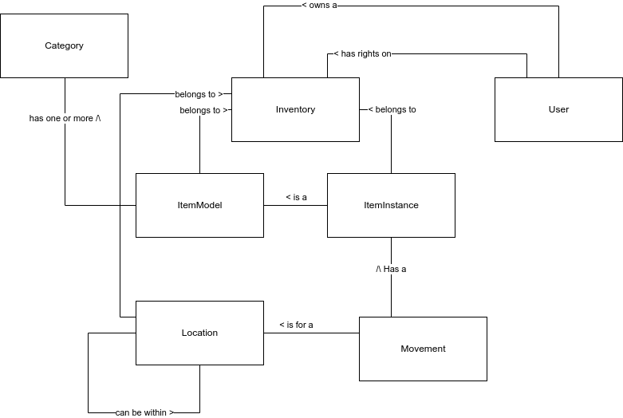

# Specification

> V 1.0-alpha, 06.03.2023

Store.Me is a simple inventory management system.

It aims to crush competition by eliminating all the complex and time-consuming features of others inventory management software.

## Functional requirements
- 3 different key concepts
    - Locations, hierarchical representation of where an item is physically
    - Category, what group does the item belongs to
    - Models, what the item is
- Locations, categories and models are part of an inventory
- An item contains the following metadata
    - Name
    - Location
    - Categories
    - Key-values created individually on the item
- An item model contains basic information about a specific item
    - Name
    - Any pre-defined key-values metadata
- A user can create and have rights on inventory
- A person can become a user by signing up
- A user can grant rights to other users on an inventory on which they have rights
- A user can look for items by location, categories or any other relevant metadata

## Nonfunctional requirements
- Separate backend & frontend
- Compatibility with PostgreSQL RDBMS
- Primary target for exploitation is Docker

## Entity model
